# CLARSLIB

- [Параметры](#task)
- [Структура](#architecture)
- [Алгоритмы](#algorithms)
- [Формат](#format)
- [ТЕСТИРОВАНИЕ](#experiments)

<a name="task"></a>

## Постановка задачи и требования

<table>
  <tr>
    <td>Кодирование</td>
    <td>LZ77 =&gt; rANS =&gt; Reed–Solomon (независимы)</td>
  </tr>
  <tr>
    <td>Контроль целостности</td>
    <td>CRC32 заголовков и исходных блоков во всех режимах</td>
  </tr>
  <tr>
    <td>Размер исходного блока</td>
    <td>1..=65536 байт</td>
  </tr>
  <tr>
    <td>Число потоков T</td>
    <td>1..=64; по умолчанию min(число процессоров, 64)</td>
  </tr>
  <tr>
    <td>Размер партии</td>
    <td>1 блок при T = 1; max(4, 2T) при T &gt; 1</td>
  </tr>
  <tr>
    <td>Порядок блоков</td>
    <td>Исходный, результат не зависит от числа T</td>
  </tr>
  <tr>
    <td>Словарь и модель</td>
    <td>Отдельные для каждого блока</td>
  </tr>
  <tr>
    <td>Выбор сжатого представления</td>
    <td>При S &lt; N</td>
  </tr>
  <tr>
    <td>Создание архива</td>
    <td>Только новый файл; существующий не перезаписывается</td>
  </tr>
  <tr>
    <td>Извлечение</td>
    <td>Только новая папка; исключение сбрасывает результат</td>
  </tr>
  <tr>
    <td>Источники</td>
    <td>Несколько файлов и папок, пустые файлы и папки, имена только в UTF8</td>
  </tr>
  <tr>
    <td>Ссылки и reparse points</td>
    <td>Запрещены</td>
  </tr>
  <tr>
    <td>Архив внутри исходной папки</td>
    <td>Исключается из входных данных</td>
  </tr>
</table>

<a name="architecture"></a>

## Структура архиватора

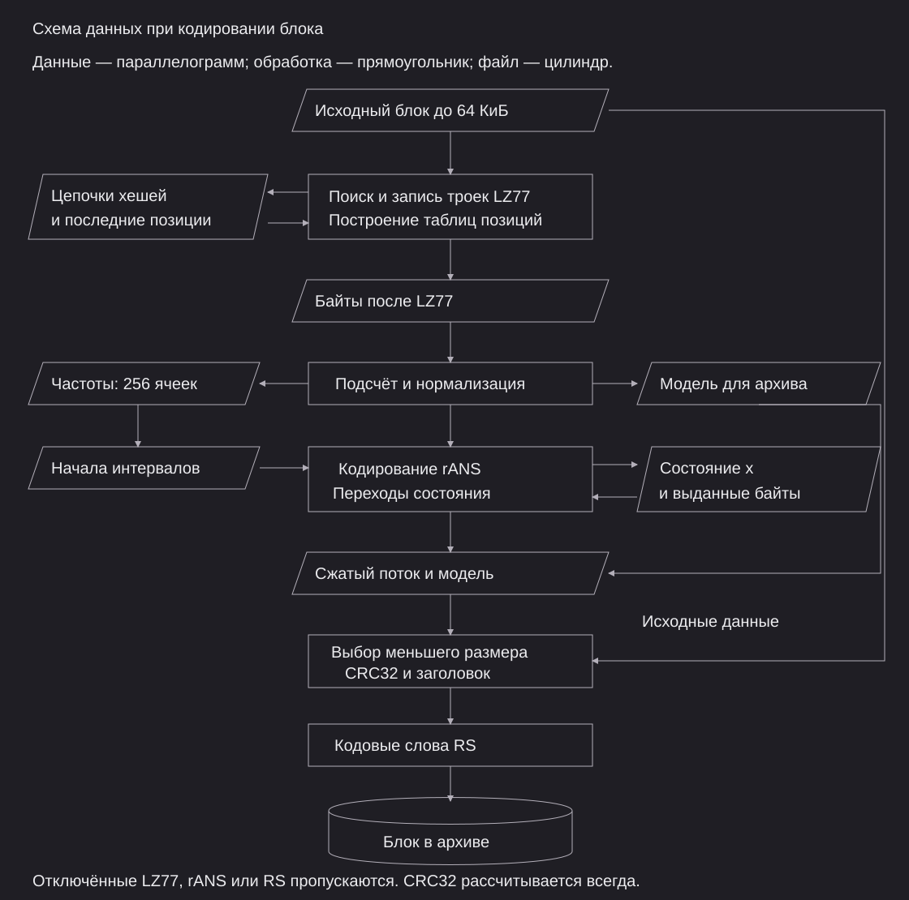

Заголовок архива хранит общие флаги режима. Заголовок каждого блока содержит исходный и сохранённый размеры, CRC32 данных и собственную контрольную сумму. Номер блока не записывается в отдельное поле, он известен по порядку чтения и используется в расчёте CRC32 заголовка.

Параллельные задания выполняются локальным пулом Rayon. Результаты записываются в исходном порядке. Пул создаётся по мере необходимости и переиспользуется для следующих партий блоков.

<a name="algorithms"></a>

## Алгоритмы

### LZ77

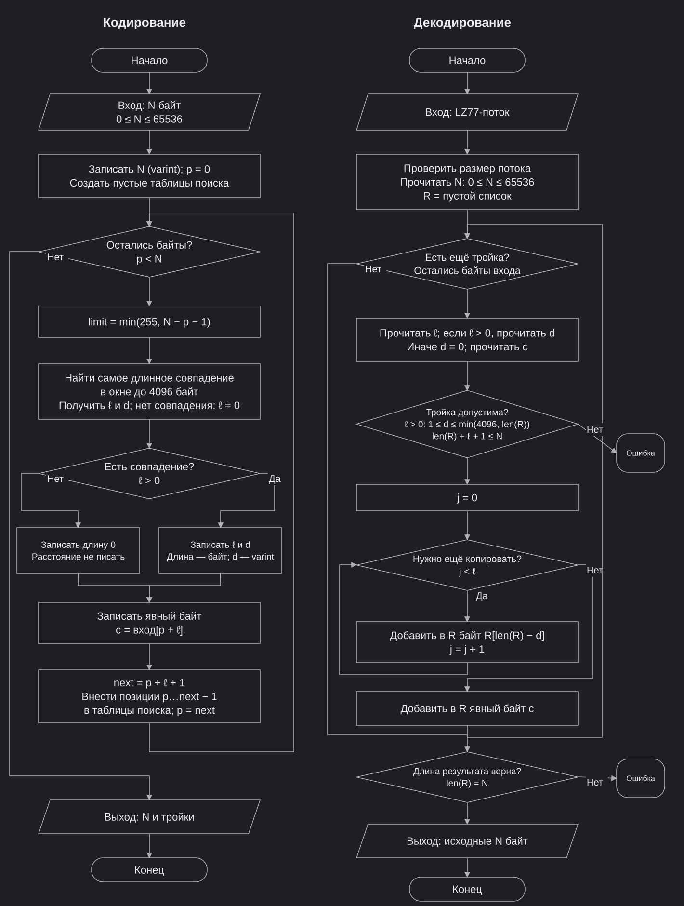

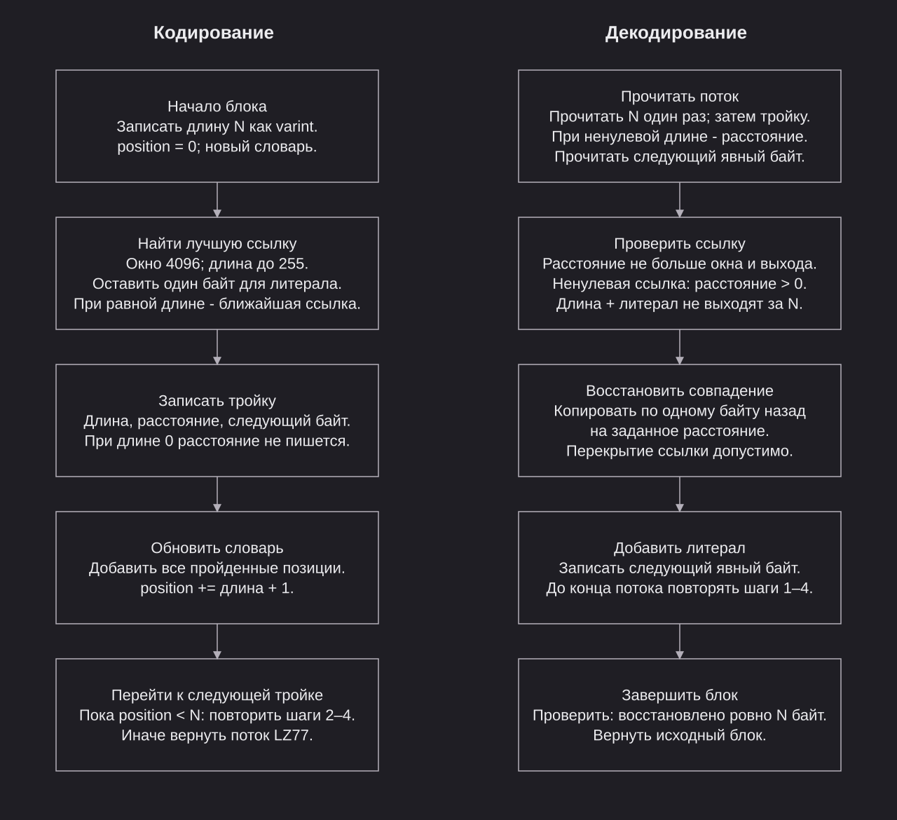

|Параметр|Значение|
|---|---|
|Единица обработки|Байт|
|Окно|4096 байт|
|Максимальная длина совпадения|255 байт|
|Результат|Расстояние, длина совпадения, следующий байт|
|Последний байт|Явный|
|Хеш|По первым двум байтам; 4096 цепочек позиций; совпадение проверяется побайтово|
|Порядок поиска|От новых позиций к старым|
|Равные длины|Ближайшее совпадение|
|Совпадение длины 1|Таблица последних позиций каждого байта|
|Обновление таблиц|Все пройденные позиции|
|Окончание поиска|Максимально допустимая длина; ограничения числа кандидатов нет|

#### Пример ABABABA

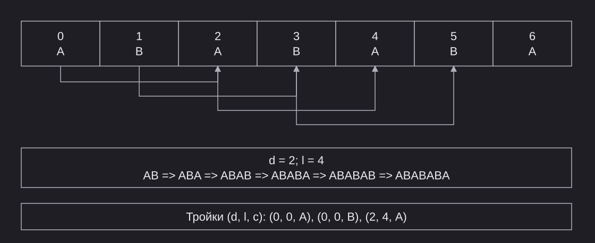

|Позиция|Совпадение|Тройка|Результат|
|---:|---|---|---|
|0|Нет|0, 0, A|A|
|1|Нет|0, 0, B|AB|
|2|ABAB, расстояние 2|2, 4, A|ABABABA|

```text
07 | 00 41 | 00 42 | 04 02 41
7      A       B    длина 4, расстояние 2, A
```

|Граничный пример|Результат|
|---|---|
|AAAAAA|(0, 0, A), (1, 4, A); перекрытие ссылки|
|abXabYabZ|На позиции 6: длина 2, расстояние 3 вместо 6|
|258 байт A|(0, 0, A), (1, 255, A), (0, 0, A)|
|AB, 4094 нулевых байта, AB!|Последняя ссылка на B: расстояние 4096|
|AB, 4095 нулевых байтов, AB!|B вне окна, явный байт|

### rANS

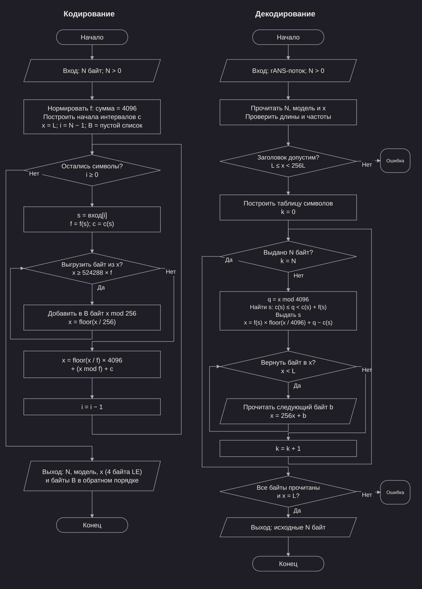

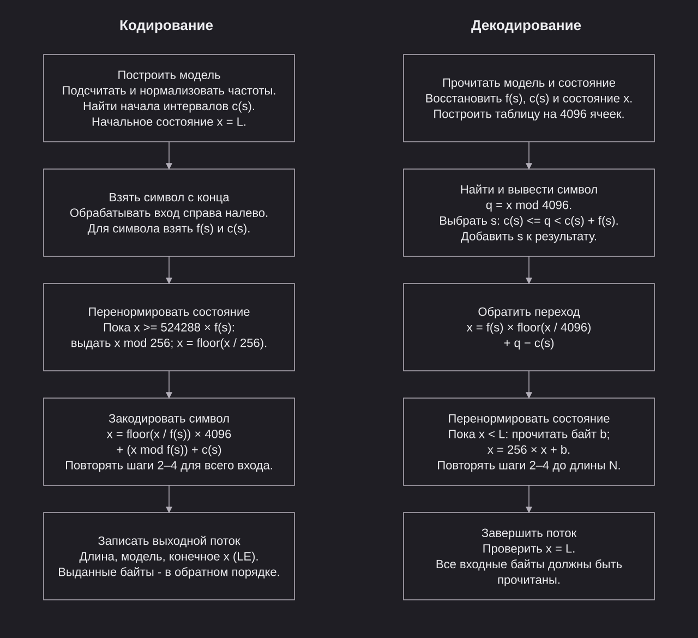

|Параметр|Значение|
|---|---|
|Состояние|Одно 32 битное целое x|
|Сумма частот M|4096 = 2^12|
|Нижняя граница L|8388608 = 2^23|
|Начальное состояние кодера|L|
|Кодирование|Справа налево|
|Декодирование|Слева направо|
|Таблица декодирования|4096 ячеек|

#### Модель частот

<table>
  <tr>
    <td>N</td>
    <td>Ненулевая длина входа</td>
  </tr>
  <tr>
    <td>D</td>
    <td>Число различных байтов</td>
  </tr>
  <tr>
    <td>n(s)</td>
    <td>Число появлений символа s</td>
  </tr>
  <tr>
    <td>f(s)</td>
    <td>Нормализованная частота</td>
  </tr>
  <tr>
    <td>c(s)</td>
    <td>Сумма частот символов, меньших s</td>
  </tr>
</table>

$$
f(s)=1+\left\lfloor\frac{n(s)(4096-D)}{N}\right\rfloor
$$

<table>
  <tr>
    <td>Распределение остатка</td>
    <td>Единицы по убыванию остатков деления n(s) * (4096 - D) на N</td>
  </tr>
  <tr>
    <td>Равные остатки</td>
    <td>Первым меньший байт</td>
  </tr>
  <tr>
    <td>Пример ABC</td>
    <td>Первоначально 1365, 1365, 1365; итог 1366, 1365, 1365</td>
  </tr>
</table>

#### Операции

<table>
  <tr>
    <td>Перенормировка кодера</td>
    <td>Пока x ≥ 524288 * f(s): выдать x mod 256, затем x = floor(x / 256)</td>
  </tr>
  <tr>
    <td>Кодирование</td>
    <td>x = floor(x / f(s)) * 4096 + (x mod f(s)) + c(s)</td>
  </tr>
  <tr>
    <td>Выбор символа</td>
    <td>q = x mod 4096; c(s) ≤ q &lt; c(s) + f(s)</td>
  </tr>
  <tr>
    <td>Декодирование</td>
    <td>x = f(s) * floor(x / 4096) + q - c(s)</td>
  </tr>
  <tr>
    <td>Перенормировка декодера</td>
    <td>Пока x &lt; L: прочитать b, затем x = 256x + b</td>
  </tr>
  <tr>
    <td>Порядок байтов в потоке</td>
    <td>Обратный порядку выдачи кодером</td>
  </tr>
</table>

#### Пример ABAB

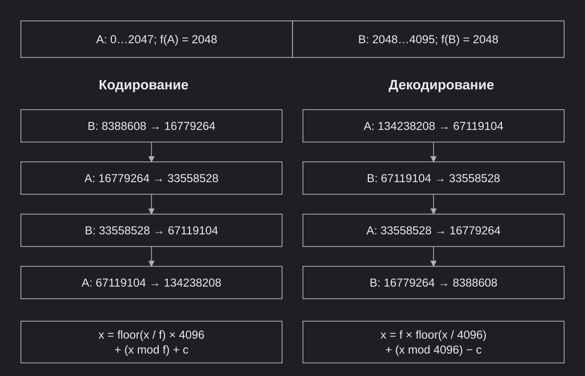

<table>
  <tr>
    <td>Выданные байты</td>
    <td>Нет</td>
  </tr>
  <tr>
    <td>Итоговое состояние</td>
    <td>08 00 50 00</td>
  </tr>
  <tr>
    <td>Частота B</td>
    <td>4096 - 2048; не хранится</td>
  </tr>
  <tr>
    <td>Размер потока</td>
    <td>10 байт</td>
  </tr>
</table>

```text
04 | 01 | 41 42 | 80 10 | 00 50 00 08
N   D-1   A,  B    f(A)    состояние
```

#### Пример перенормировки ABABABABABABABAB

`f(A) = f(B) = 2048; порог = 1073741824`

|Переход|Символ|x до выдачи|Байт|x после деления на 256|x после перехода|
|---:|---|---:|---|---:|---:|
|8|A|1073915904|00|4194984|8389288|
|16|A|1073916584|A8|4194986|8389290|

<table>
  <tr>
    <td>Итоговое состояние 00 80 02 AA</td>
    <td>AA 02 80 00</td>
  </tr>
  <tr>
    <td>Перенормировка</td>
    <td>A8 00</td>
  </tr>
  <tr>
    <td>Полный поток</td>
    <td>10 01 41 42 80 10 AA 02 80 00 A8 00</td>
  </tr>
</table>

### CRC32

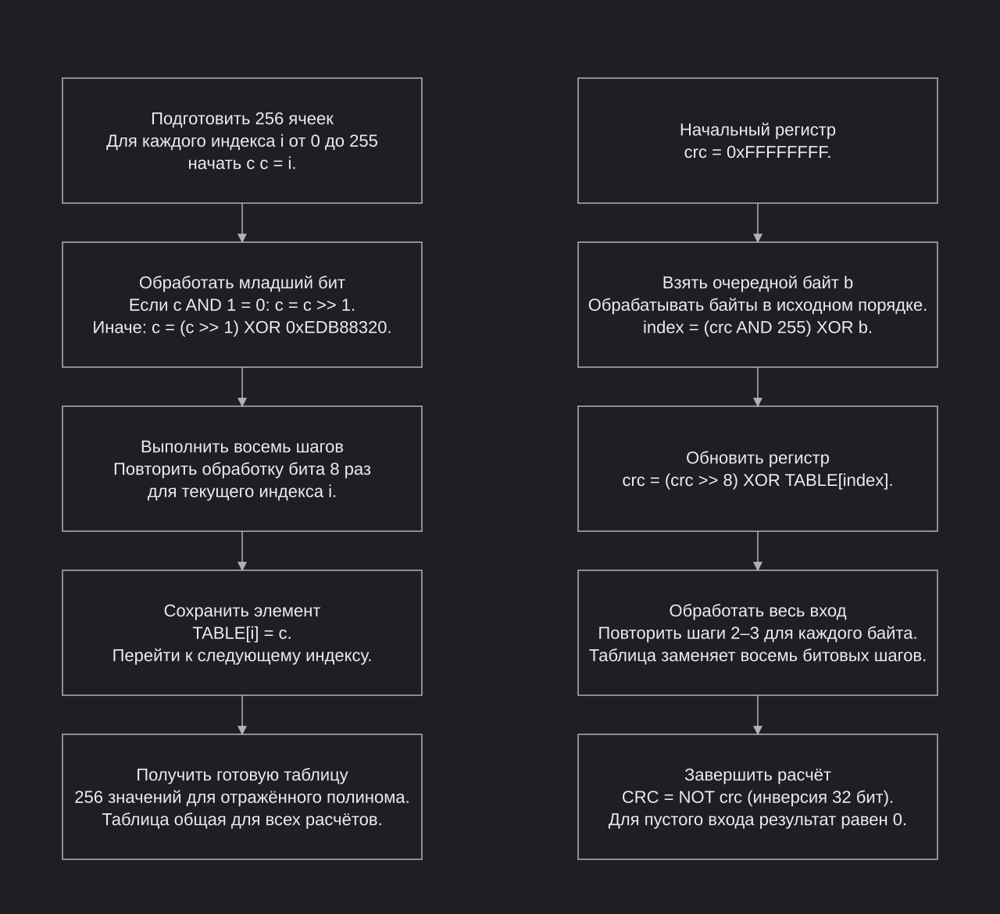

<table>
  <tr>
    <td>Начальный регистр</td>
    <td>FF FF FF FF</td>
  </tr>
  <tr>
    <td>Отражённый полином</td>
    <td>ED B8 83 20</td>
  </tr>
  <tr>
    <td>Начало обработки байта</td>
    <td>Регистр XOR байт</td>
  </tr>
  <tr>
    <td>Шаг</td>
    <td>Сдвиг вправо; XOR с полиномом при прежнем младшем бите 1</td>
  </tr>
  <tr>
    <td>Шагов на байт</td>
    <td>8; в реализации таблица из 256 значений</td>
  </tr>
  <tr>
    <td>Завершение</td>
    <td>Инверсия регистра</td>
  </tr>
  <tr>
    <td>Область CRC данных</td>
    <td>Полный исходный блок, включая имена и размеры</td>
  </tr>
</table>

#### Расчёт для A = 41

|Шаг|Регистр|
|---|---|
|После XOR|FF FF FF BE|
|1|7F FF FF DF|
|2|D2 47 7C CF|
|3|84 9B 3D 47|
|4|AF F5 1D 83|
|5|BA 42 0D E1|
|6|B0 99 85 D0|
|7|58 4C C2 E8|
|8|2C 26 61 74|
|После инверсии|D3 D9 9E 8B|

|Вход|CRC32|
|---|---|
|Пустой|00 00 00 00|
|123456789|CB F4 39 26|
|ABABABA|DB C2 50 ED|

### Reed–Solomon

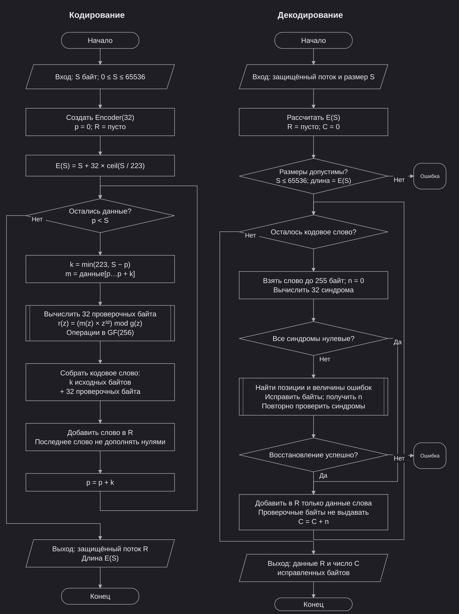

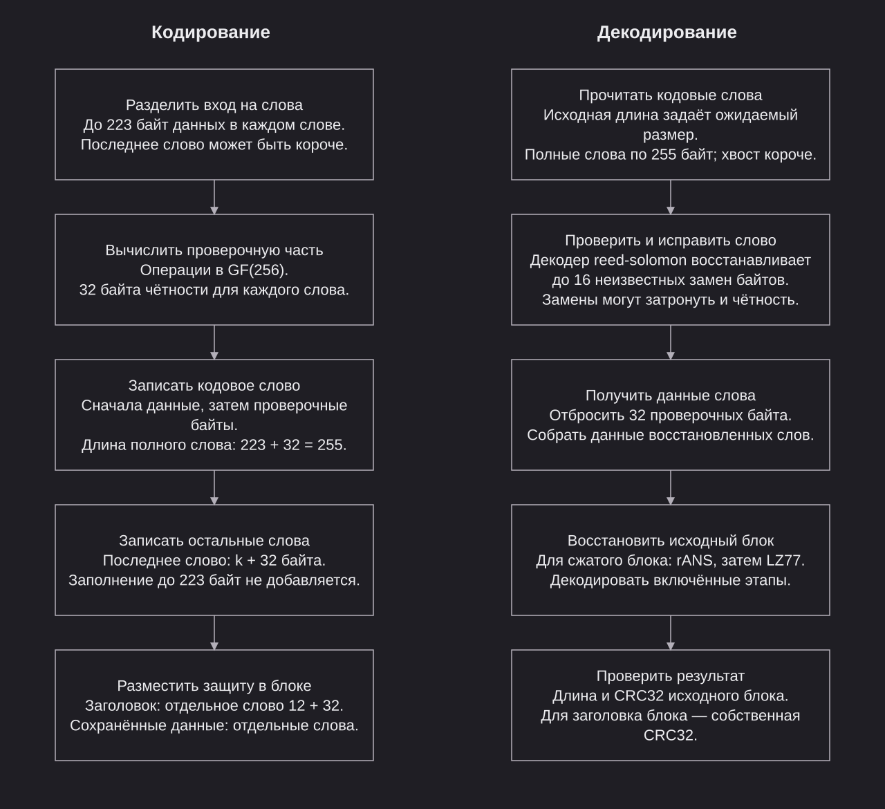

<table>
  <tr>
    <td>Код</td>
    <td>RS(255,223), систематический</td>
  </tr>
  <tr>
    <td>Данные</td>
    <td>До 223 байт в слове</td>
  </tr>
  <tr>
    <td>Проверочная часть</td>
    <td>32 байта после данных каждого слова</td>
  </tr>
  <tr>
    <td>Последнее слово</td>
    <td>Укороченное, без заполнения до 223 байт</td>
  </tr>
  <tr>
    <td>Заголовок блока</td>
    <td>Отдельное слово 12 + 32 байта</td>
  </tr>
  <tr>
    <td>Исправление</td>
    <td>До 16 неизвестных замен байтов в слове, включая проверочную часть</td>
  </tr>
  <tr>
    <td>Более 16 замен</td>
    <td>Восстановление не гарантируется</td>
  </tr>
  <tr>
    <td>Дополнительная проверка</td>
    <td>CRC исходного блока после восстановления</td>
  </tr>
</table>

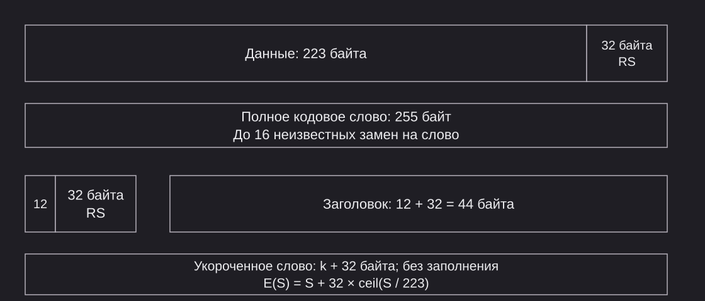

#### Поле GF(256)

|Операция или параметр|Значение|
|---|---|
|Представление байта|Многочлен степени ≤ 7 с коэффициентами 0 и 1|
|Пример 83 hex|x^7 + x + 1|
|Сложение и вычитание|XOR|
|Умножение|Произведение многочленов по модулю p(x)|
|Модуль p(x)|x^8 + x^4 + x^3 + x^2 + 1, 11D hex|
|Примитивный элемент α|02 hex; период степеней 255|
|Пример 80 * 02|x^8 mod p(x) = x^4 + x^3 + x^2 + 1 = 1D hex|
|Умножение и деление ненулевых элементов|Таблицы степеней и логарифмов α|

#### Проверочные байты

$$
g(x)=\prod_{i=0}^{31}(x+\alpha^i)
$$

где g(x) — порождающий многочлен; α — примитивный элемент GF(256).

$$
r(x)=m(x)x^{32}\bmod g(x)
$$

где m(x) — многочлен данных; r(x) — многочлен проверочных байтов; g(x) — порождающий многочлен.

$$
c(x)=m(x)x^{32}+r(x),\qquad c(x)\bmod g(x)=0
$$

где c(x) — многочлен кодового слова. Операции выполняются в GF(256).

|Первые множители g(x)|Коэффициенты, hex|
|---:|---|
|1|01 01|
|2|01 03 02|
|3|01 07 0E 08|

Кодовое слово для сообщения 01, слева данные, справа 32 проверочных байта:

```text
01 | 74 40 34 AE 36 7E 10 C2 A2 21 21 9D B0 C5 E1 0C
     3B 37 FD E4 94 2F B3 B9 18 8A FD 14 8E 37 AC 58
```

#### Исправление первого байта 01 => 54

|Величина|Значение|
|---|---|
|Ошибка e|01 XOR 54 = 55 hex|
|Синдромы S_i|Значения повреждённого слова в α^i, i = 0..=31|
|Синдромы неповреждённого слова|Все нулевые|
|Первые синдромы|S_0 = 55, S_1 = 62 hex|
|Одна ошибка в степени j|S_i = e * (α^j)^i|
|Локализация|S_1/S_0 = 9D hex = α^32; j = 32|
|Позиция в слове из 33 байт|33 - 1 - 32 = 0|
|Исправление|54 XOR 55 = 01|
|Контроль|Все синдромы снова нулевые|

<a name="format"></a>

## Формат

Формат CLARSLIB рассчитан на последовательную запись и чтение. В этом разделе смещения отсчитываются от начала соответствующей структуры, размеры выражаются в байтах, если не указано иное. Приведённые значения — параметры формата, а не результаты измерений производительности.

<table>
  <tr>
    <td>Смещения</td>
    <td>От нуля; относительно начала описываемой структуры</td>
  </tr>
  <tr>
    <td>Размеры</td>
    <td>В байтах, кроме явно обозначенных битовых полей</td>
  </tr>
  <tr>
    <td>Многобайтовые целые</td>
    <td>Младший байт первым</td>
  </tr>
  <tr>
    <td>Записи файлов</td>
    <td>Последовательный поток внутри блоков; переход через границу блока допустим</td>
  </tr>
</table>

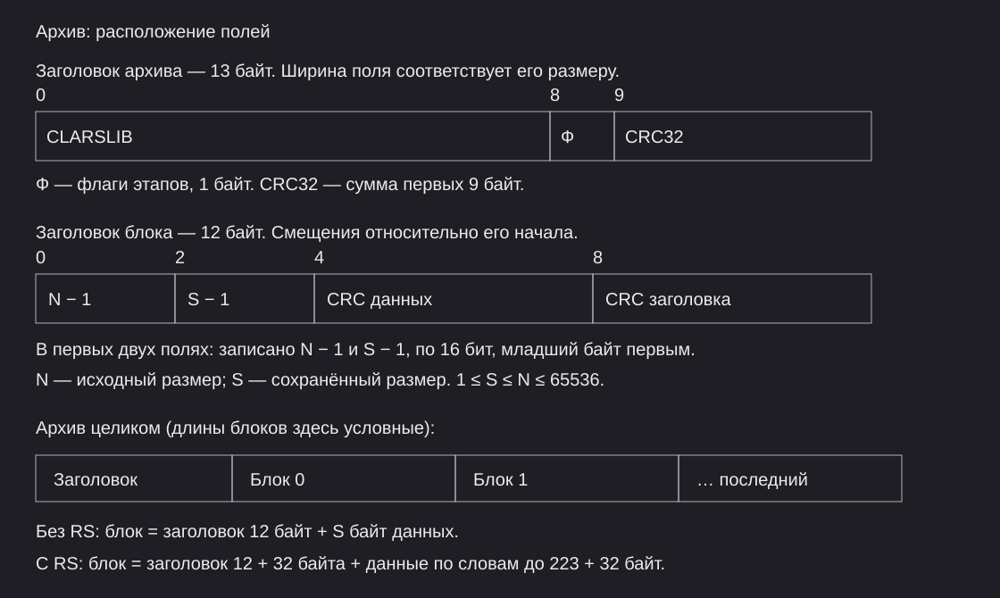

### Заголовок архива

|Смещение|Размер|Поле|Допустимые значения|
|---:|---:|---|---|
|0|8|Подпись|`43 4C 41 52 53 4C 49 42` => CLARSLIB|
|8|1|Флаги|Бит 0 -> LZ77, 1 -> rANS, 2 -> RS; 3–7 нулевые|
|9|4|CRC32|Контрольная сумма первых 9 байт|

<table>
  <tr>
    <td>Общий размер</td>
    <td>13 байт</td>
  </tr>
  <tr>
    <td>Область настроек</td>
    <td>Весь архив</td>
  </tr>
  <tr>
    <td>Защита RS</td>
    <td>Отсутствует; неверная подпись или CRC прекращает чтение</td>
  </tr>
</table>

|Флаги|Этапы|
|---:|---|
|00|Без сжатия и RS|
|01|LZ77|
|02|rANS|
|03|LZ77 => rANS|
|04|RS|
|05|LZ77 => RS|
|06|rANS => RS|
|07|LZ77 => rANS => RS|

### Заголовок блока

|Смещение|Размер|Поле|Допустимые значения|
|---:|---:|---|---|
|0|2|N - 1|Исходный размер N = 1..=65536; записано 0..=65535|
|2|2|S - 1|Сохранённый размер S = 1..=N, без проверочных байтов RS|
|4|4|CRC данных|CRC32 исходного блока с именами, размерами и содержимым записей|
|8|4|CRC заголовка|CRC32 от номера блока в 8 байтах и первых 8 байт заголовка|

|Условие|Представление и ограничения|
|---|---|
|Номер блока|От 0; не хранится, определяется порядком чтения; в расчёте CRC младшим байтом вперёд|
|S = N|Исходные данные|
|S < N|Результат выбранного LZ77, rANS или LZ77 => rANS; подмена этапов запрещена|
|Оба сжатия отключены|Только S = N|
|Сжатый блок с rANS|S ≥ 7|
|Без RS|12 + S байт|
|С RS|Заголовок 12 + 32 байта; данные отдельными словами до 223 + 32 байт|
|Проверка при чтении|RS заголовка, CRC заголовка, ограничения размеров, восстановление данных, размер N и CRC данных|

$$
E(S)=S+32\left\lceil\frac{S}{223}\right\rceil
$$

где S — число байтов до добавления RS; E(S) — размер данных с проверочной частью.

$$
B_{RS}=44+E(S)
$$

где B_RS — размер защищённого блока; 44 — размер заголовка блока с проверочной частью.

### Записи файлов и папок

<table>
  <tr>
    <td>P</td>
    <td>Длина имени в байтах UTF8</td>
  </tr>
  <tr>
    <td>F</td>
    <td>Размер файла</td>
  </tr>
  <tr>
    <td>a, b</td>
    <td>Длины переменной записи P и F</td>
  </tr>
</table>

|Смещение|Размер|Поле|Допустимые значения|
|---:|---:|---|---|
|0|1|Тип|0 конец архива, 1 файл, 2 папка; прочие запрещены|
|1|a = 1..=2|Длина имени P|1..=4096; только типы 1 и 2|
|1 + a|P|Имя|UTF8; разделитель `/`|
|1 + a + P|b = 1..=10|Размер F|0..2^64 - 1; только тип 1|
|1 + a + P + b|F|Содержимое|Ровно F байт; только тип 1|

|Ограничение|Значение|
|---|---|
|Конец архива|Один байт 00; последующие данные и блоки запрещены|
|Пустой файл|F = 0|
|Пустая папка|Обычная запись типа 2|
|Порядок записей|Родительская папка раньше её содержимого|
|Компонент имени|Не более 255 байт|
|Глубина|Не более 128 уровней|
|Число записей|Не более 100000|
|Запрещённые пути|Абсолютные, `.` и `..`, обратный слеш, управляющие символы, имена устройств Windows|
|Повторы|Запрещены без учёта регистра; одинаковое имя файла и папки запрещено|

### Переменные целые и битовые поля

$$
V=\sum_{i=0}^{k-1}(b_i\bmod 128)\,2^{7i}
$$

где `b_i` — i-й байт varint, `k` — число байтов, `i` — индекс группы с нуля. `b_i mod 128` удаляет бит продолжения.

|Поле байта|Размер|Значение|
|---|---:|---|
|Биты 0-6|7 бит|Очередная группа числа, начиная с младших разрядов|
|Бит 7|1 бит|1 продолжение, 0 последний байт|

|Ограничение|Значение|
|---|---|
|Длина записи|1..=10 байт; только кратчайшая запись|
|Десятый байт|Только 01|
|Ноль|Только однобайтовое 00; 80 00 запрещено|

|Число|Байты|
|---:|---|
|127|7F|
|128|80 01|
|4096|80 20|
|65536|80 80 04|

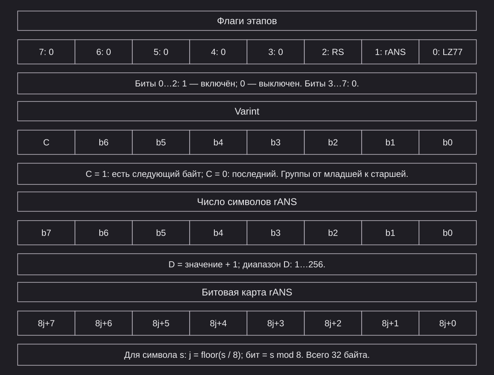

### Поток LZ77

|Часть|Размер|Значение|
|---|---:|---|
|Исходная длина|1..=3|Переменное целое 0..=65536|
|Тройки|Переменный|Последовательность полей из таблицы ниже|

|Смещение в тройке|Размер|Поле|Допустимые значения|
|---:|---:|---|---|
|0|1|Длина совпадения|0..=255|
|1|d = 0, 1 или 2|Расстояние|Отсутствует при длине 0; иначе переменное целое 1..=4096|
|1 + d|1|Следующий байт|00..=FF|

|Ограничение|Значение|
|---|---|
|Расстояние|Не больше длины уже восстановленной части|
|Перекрытие|Допустимо; последовательное побайтовое копирование|
|Длина результата тройки|Длина совпадения + 1|
|Пустой вход|Поток 00|
|Максимальный размер потока|131075 байт: 3 + 2 * 65536|

### Поток rANS

<table>
  <tr>
    <td>n</td>
    <td>Размер переменной записи исходной длины</td>
  </tr>
  <tr>
    <td>D</td>
    <td>Число различных символов</td>
  </tr>
  <tr>
    <td>A</td>
    <td>Размер записи алфавита</td>
  </tr>
  <tr>
    <td>Q</td>
    <td>Суммарный размер записанных частот</td>
  </tr>
  <tr>
    <td>Вход</td>
    <td>Исходный блок или результат LZ77</td>
  </tr>
</table>

|Смещение|Размер|Поле|Допустимые значения|
|---:|---:|---|---|
|0|n = 1..=3|Длина результата|0..=131075; без LZ77 итог ограничен размером блока|
|n|1|D - 1|0..=255; D = 1..=256, D не больше длины результата|
|n + 1|A|Алфавит|D байт при D ≤ 32; иначе битовая карта из 32 байт|
|n + 1 + A|Q|Частоты|D - 1 положительных частот; каждая переменным целым в 1..=2 байта|
|n + 1 + A + Q|4|Состояние x|2^23 ≤ x < 2^31|
|n + 5 + A + Q|Остаток потока|Байты перенормировки|Обратный порядок выдачи|

|Ограничение|Значение|
|---|---|
|Нулевая длина|Только 00; остальных полей нет|
|Список символов|Строго возрастающий|
|Битовая карта|Символ s: бит s mod 8 в байте floor(s / 8); число единиц равно D|
|Сумма частот|4096|
|Последняя частота|4096 минус сумма записанных частот; отдельно не хранится|
|D = 1|Единственная частота 4096, записанных частот нет|
|D > 1|Каждая частота 1..=4095; сумма оставляет хотя бы единицу каждому оставшемуся символу|
|Окончание декодирования|Состояние 2^23, неиспользованных байтов нет|

### Пример архива

|Параметр|Значение|
|---|---|
|Имя файла|`a`|
|Содержимое|`ABABABA`, 7 байт без перевода строки|
|Этапы|LZ77 и rANS, без RS|
|Размер логической записи|12 байт|
|Размеры блока|N = S = 12, сжатие невыгодно|
|Размер архива|37 байт|

```text
01 | 01 | 61 | 07 | 41 42 41 42 41 42 41 | 00
тип  P    a    F           данные          кц
```

```text
00000000  43 4C 41 52 53 4C 49 42 03 13 B3 62 56 0B 00 0B
00000010  00 36 3B FA 12 B3 72 82 3B 01 01 61 07 41 42 41
00000020  42 41 42 41 00
```

|Поле|Значение|Расшифровка|
|---|---|---|
|N - 1, S - 1|0B 00|11; N = S = 12|
|CRC данных|12FA3B36|Весь исходный блок|
|CRC заголовка блока|3B8272B3|Номер 0 и первые 8 байт заголовка|

|Область|Смещения без RS|Смещения с RS|
|---|---|---|
|Заголовок архива|00–0C|00–0C|
|Заголовок блока|0D–18|0D–18|
|Проверочные байты заголовка|Нет|19–38|
|Запись файла и конец|19–24|39–44|
|Проверочные байты данных|Нет|45–64|
|Размер|37 байт|101 байт|
|Флаги|03|07; CRC заголовка архива пересчитывается|

<a name="experiments"></a>

## Экспериментальные исследования

### 5.1 ТЕСТИРОВАНИЕ
